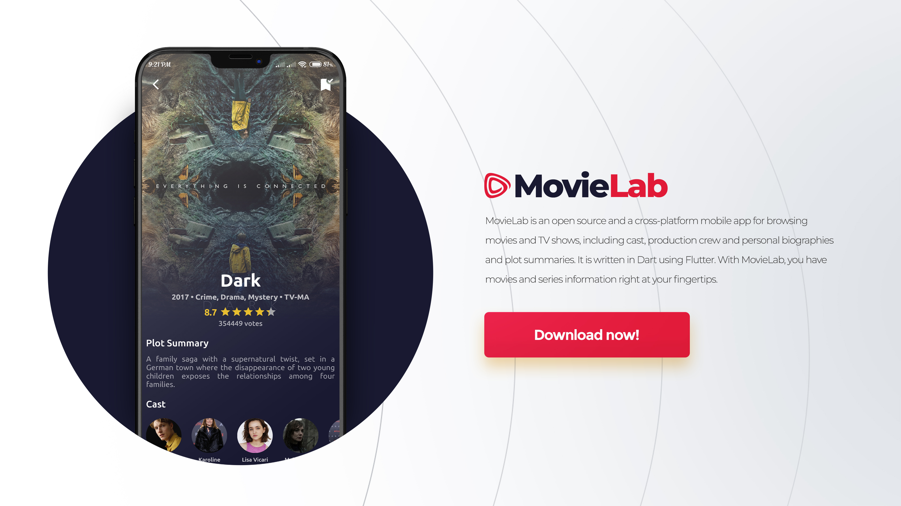

# 🎬 CineMagic: Movies & TV Guide

Discover, track, and schedule your favorite cinematic experiences. Sourced directly from the largest global media databases.

<p align="center">
  
</p>

---

## 🎨 Premium Visual Design

CineMagic offers a state-of-the-art visual experience designed with a rich cinematic aesthetic:
* **Full-Bleed Posters:** Dynamic poster backdrops that blend smoothly using high-fidelity color gradients.
* **Fluid Gestures:** Interactive gestures, swipe-to-remove grids, and beautiful hero page-transitions.
* **Trailer Integration:** Direct YouTube player integration to view trailers instantly.

---

## ✨ Key Features

### 🔍 Unified Media Directory
* **IMDb Integration:** Query movies, TV series, seasons, and episodes with extensive details (e.g., cast, crew, synopses, and reviews).
* **Smart Recommendations:** Real-time recommendations engine suggests content tailored to your preferences.

### 📦 Supercharged NoSQL Watchlist
* **Sub-Millisecond Queries:** Powered by **Hive DB** to query, add, or remove titles with zero lag.
* **Fully Localized Storage:** Your watchlist is saved entirely on-device, ensuring offline access.

### ⏰ Premium Feature: Watchlist Reminder Engine [Phase 4 Update]
CineMagic now features an interactive media scheduling and notification suite to keep you in sync with your watchlist:

> [!TIP]
> **Plan Ahead:** Click the dynamic alarm bell chip on any media page to queue a local push reminder for your planned watch date and time.

---

## 🏗️ Clean Architecture Overview

The reminder module is isolated under `lib/features/watchlist_reminder/`, upholding clean architectural and SOLID principles:

```
lib/features/watchlist_reminder/
├── domain/
│   ├── models/           # Immutable WatchlistReminder data entity mapping movie IDs and times
│   └── repositories/     # Repository contract interface specifying scheduling queries
├── data/
│   ├── datasources/      # Concrete local Hive database adapters
│   └── repositories/     # Decoupled implementation binding domain contracts and datasources
└── presentation/
    ├── controllers/      # WatchlistReminderController (GetX) driving state and scheduling push triggers
    └── widgets/          # Animated schedule chips and time picker sheet overlays
```

---

## 🛠️ Setup & Local Configuration

### 1. Retrieve API Key
1. Register for an account on the [IMDb API Console](https://imdb-api.com/).
2. Fetch your free API key in your developer profile.

### 2. Configure Code
Open `lib/.api.dart` and enter your credentials:
```dart
List<String> apiKeys = ["YOUR_API_KEY_HERE"];
```

### 3. Run Commands
1. Install package dependencies:
   ```bash
   flutter pub get
   ```
2. Run code analysis:
   ```bash
   flutter analyze
   ```
3. Compile production-ready APK:
   ```bash
   flutter build apk --release
   ```

---

## 📄 License & Open-Source
Distributed under the **Apache-2.0 License**. See [LICENSE](LICENSE) for more details.
Contributions and Pull Requests are always welcome!
